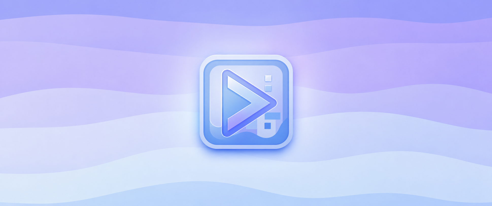

# xdBot

xdBot is a Geometry Dash botting and macro utility built as a Geode mod. It is
designed to be easy to use for showcases, macro playback, recording, practice
tools, trajectory helpers, and high-quality rendering where the platform
supports it.

Current target: Geometry Dash 2.2081  
Current Geode SDK: 5.7.1
NOW WiTH DISCORD 

## 🌐 Socials

  
  <b>Discord:</b> https://discord.gg/GsvGnqYvaz

  📢 <b>GDMacros:</b> https://t.me/gdmacros

  📢 <b>GDModding:</b> https://t.me/gdm_modding

## Features

- Record and play back macros with xdBot's macro system.
- Continue botting from practice checkpoints.
- TPS Bypass, SpeedHack, Speed Audio Sync, and Frame Stepper tools.
- Show Trajectory with portal, orb, pad, and frame-perfect support.
- Autoclicker, Clickbot, Ghost Playback, Path Finder, Layout Mode, and other
  utility features.
- Import support for multiple macro formats, including `.gdr`, `.gdr2`, `.cml`,
  tcBot, and Silicate.
- Auto Safe Mode to reduce accidental unsafe playback situations.
- Built-in update channel support for Main and Dev-beta builds.

## Rendering

xdBot includes a rendering system for creating showcase videos.

- Windows: rendering is available with `ffmpeg.exe` configured in the mod
  settings, or with a compatible FFmpeg API setup.
- Android: rendering uses `eclipse.ffmpeg-api`.
- iOS: platform support is restored, but rendering is intentionally disabled.
  The renderer is stubbed and will show `Rendering is not available on iOS`.

Recent builds also include faster PC rendering and preview tools for video
filters and custom FFmpeg arguments.

## Platforms

| Platform | Status | Notes |
| --- | --- | --- |
| Windows | Supported | Full feature set, including rendering |
| Android | Supported | Requires `eclipse.ffmpeg-api` for rendering |
| iOS | Supported | Rendering is not available |

## Installation

1. Install Geode for your Geometry Dash platform.
2. Download the latest `zilko.xdbot.geode` release.
3. Put the `.geode` file into your Geode `mods` folder.
4. Launch Geometry Dash and open the xdBot menu in-game.

## Notes

xdBot is intended for showcases, testing, and macro workflows. Use it
responsibly and follow the rules of the communities where you share your
content.

This project is not affiliated with RobTop Games or the official Geode team.
